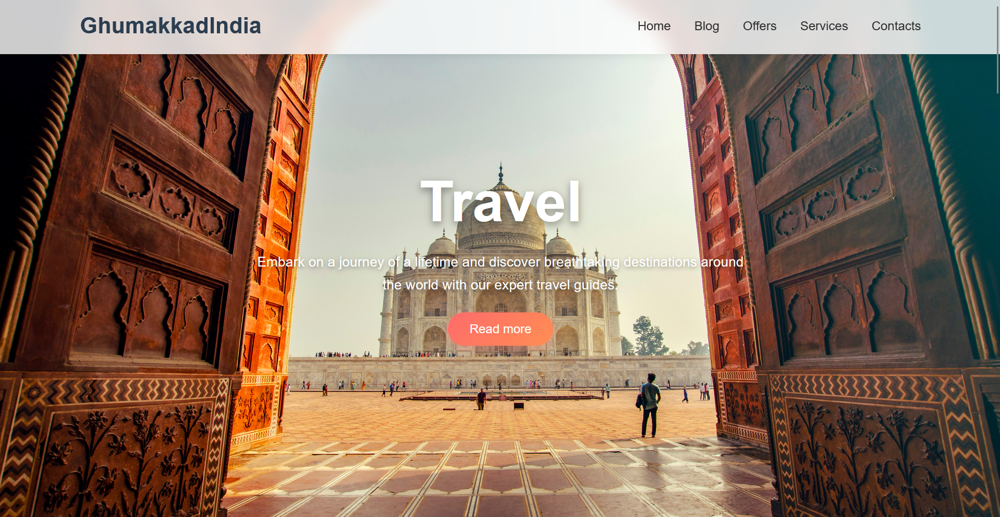
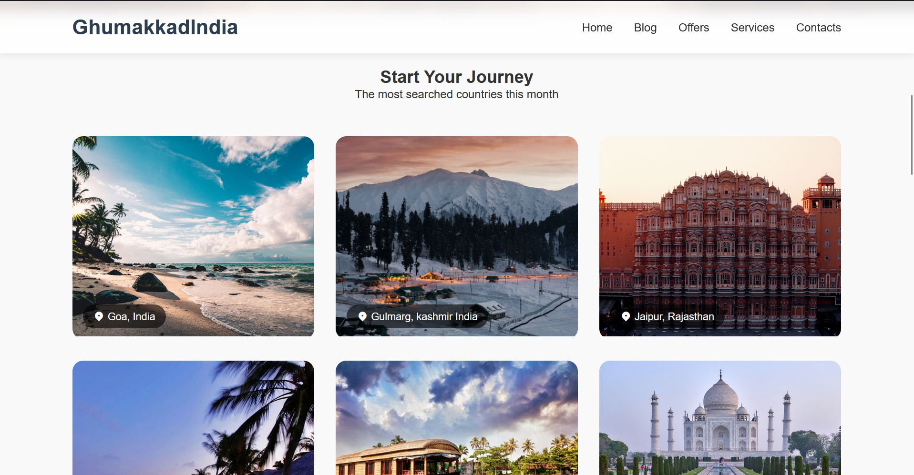
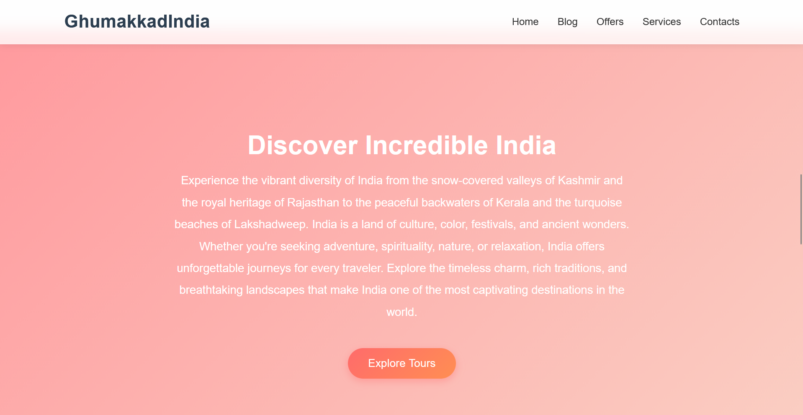
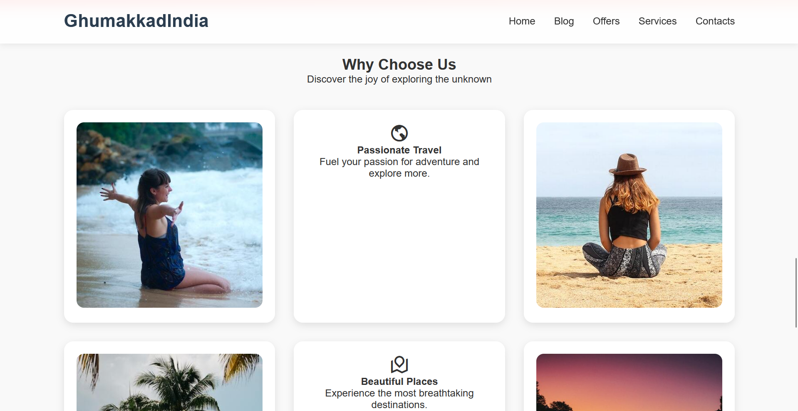

# 🌍 GhumakkadIndia – Explore Incredible India

A modern, responsive, and visually rich travel website built using **HTML5** and **CSS3**, designed to showcase the beauty, culture, and diversity of India.  
This project focuses on clean UI, smooth interactions, and a seamless user experience across all devices.

---

## ✨ Features

### 🏖️ Beautiful Hero Section
A full-screen beach background (Goa/Lakshadweep inspired) with smooth text contrast and a clean CTA.

### 🌄 Indian Destinations Highlight
A dedicated “Start Your Journey” section showcasing India’s top travel spots like Goa, Kashmir, Jaipur, Kerala, Lakshadweep, and more.

### 🇮🇳 Incredible India Banner
A polished, gradient-themed banner section describing the essence of Indian tourism.

### 💡 Why Choose Us
A grid-based section featuring icons, high-quality images, and micro-interactions to highlight the platform's strengths.

### 🎨 Modern UI & UX
- Glassmorphism navigation bar  
- Smooth hover animations  
- Responsive grid layout  
- CDN-based icons (Remix Icons)  
- Clean typography with Poppins font  

### 📱 Fully Responsive
Optimized for mobile, tablet, and widescreen displays ensuring a flawless browsing experience.

---

## 📸 Project Screenshots

<p align="center">
  
  
</p>

<p align="center">
  
  
</p>

---

## 🛠️ Tech Stack

- **HTML5** – Semantic and structured layout  
- **CSS3** – Flexbox, Grid, Transitions, Gradients, Glass Effects  
- **RemixIcon CDN** – Lightweight elegant icons  
- **Unsplash CDN Images** – High-resolution scenic images  

---


1. Download or clone this repository:
   ```bash
   git clone https://github.com/Arpitaagupta/GhumakkadIndia
   ```
2. Open the project folder

3. Run **index.html** in any browser

4. Enjoy exploring **GhumakkadIndia ✨**

🤝 **Contributions**

Feel free to fork the project and enhance it!  
UI improvements, animations, new destinations, or backend integration ideas are always welcome.

❤️ **Made with Love for Indian Tourism**

GhumakkadIndia celebrates the heritage, landscapes, and cultural richness of India.
